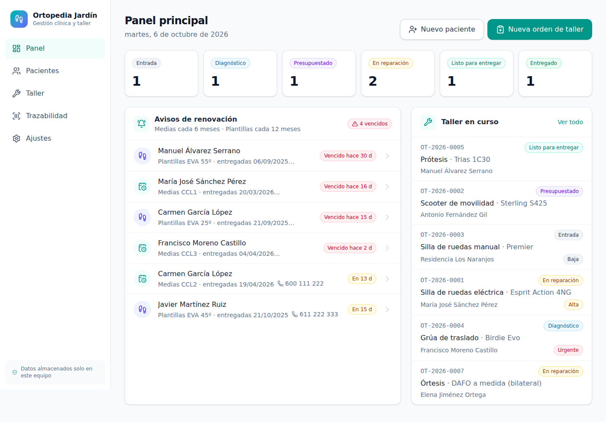
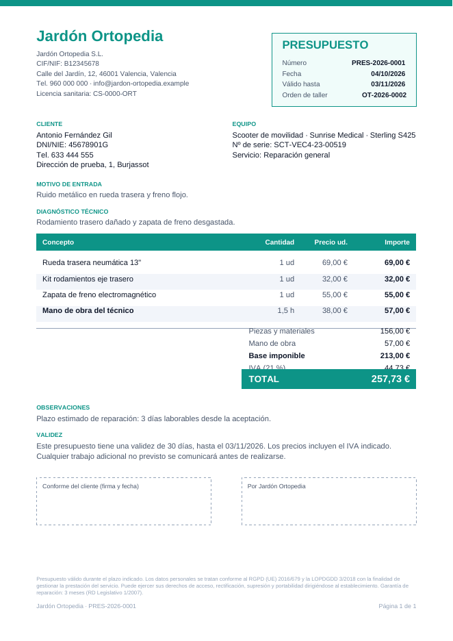

# Jardón Ortopedia · Gestión clínica y de taller

Web App **100 % local** para una ortopedia: historial clínico (plantillas a medida y medias de compresión),
taller de reparaciones con desglose de costes, trazabilidad por número de serie y copias de seguridad.
Funciona en el PC de la tienda y se usa desde tablets y móviles conectados a la misma Wi-Fi.
Ningún dato sale del equipo (sin servicios en la nube, sin telemetría).

**Requisitos:** Node.js 22.13 o superior (LTS recomendado).

**Stack:** Next.js 16 (App Router) · TypeScript · Tailwind CSS 4 · Prisma 6 · SQLite · lucide-react



## Instalación en el ordenador de la tienda (Windows)

1. Instale **Node.js LTS** desde <https://nodejs.org/es> (siguiente, siguiente, finalizar) y **reinicie** el ordenador.
2. Descomprima el ZIP de la aplicación (clic derecho → **Extraer todo**), por ejemplo en `C:\JardonOrtopedia`.
3. Dentro de esa carpeta, haga **doble clic en `INSTALAR.bat`**. Descarga lo necesario, pregunta si quiere
   datos de prueba, prepara la app, la arranca y abre el navegador.
   - Si Windows muestra «Windows protegió su PC», pulse **Más información → Ejecutar de todas formas**.
   - Si aparece el aviso del **Firewall**, marque solo **Redes privadas** y pulse **Permitir acceso**.
4. Los demás días: **doble clic en `ARRANCAR.bat`** (o configure el arranque automático, abajo).

En la ventana negra aparece la dirección para la Wi-Fi, p. ej. `http://192.168.1.40:3000`: ábrala desde la
tablet, el móvil u otros ordenadores. **Solo un ordenador ejecuta la app** (el que guarda los datos); los demás
dispositivos usan el navegador. La red de la tienda debe estar marcada como **Privada** en Windows.

En macOS o Linux: `npm install`, `cp .env.example .env`, `npm run build` y `npm start`.

### Arranque automático al encender el ordenador

| Sistema | Instalar | Quitar |
| --- | --- | --- |
| **Windows** | Clic derecho en `scripts/windows/instalar-inicio.ps1` → *Ejecutar con PowerShell* | `scripts/windows/desinstalar-inicio.ps1` |
| **macOS** | `zsh scripts/macos/instalar-inicio.sh` | `launchctl bootout gui/$(id -u)/es.jardon.ortopedia` |
| **Linux** | `bash scripts/linux/instalar-inicio.sh` | `systemctl --user disable --now jardon-ortopedia` |

En Windows, el script crea una tarea programada que arranca la app al iniciar sesión (sin ventana, con
reinicio automático si se cierra) y abre el puerto 3000 en el cortafuegos **solo para redes privadas**.
Para arrancarla a mano basta con hacer doble clic en `ARRANCAR.bat`.
El registro de funcionamiento queda en `logs/servidor.log`.

### Probar con datos ficticios y después empezar de cero

```bash
npm run demo     # ⚠️ BORRA todos los datos y carga pacientes, órdenes y 12 meses de histórico de ejemplo
npm start        # pruebe la app en el ordenador y en el móvil
npm run vaciar   # deja la app vacía (pide escribir VACIAR; los datos anteriores se apartan a backups/)
```

| Script | Uso |
| --- | --- |
| `npm start` | Aplica las actualizaciones pendientes de la base de datos (sin borrar nada) y arranca |
| `npm run demo` / `npm run db:seed` | Datos ficticios — **borran los datos existentes** |
| `npm run vaciar` | Deja la app vacía para empezar con datos reales (mueve los actuales a `backups/`) |
| `npm run db:migrate` | (Desarrollo) crea una migración tras cambiar `schema.prisma` |
| `npm run db:studio` | Explorador visual de la base de datos |
| `npm run lint` | Comprobación de tipos |

## Estructura

```
prisma/
  schema.prisma          Modelo de datos completo (4 módulos)
  seed.ts                Datos ficticios con fechas relativas a hoy
  migrations/
scripts/lan-info.mjs     Muestra las IPs de la red local al arrancar
uploads/<pacienteId>/    Estudios de pisada, fotos de huellas, recetas (no versionado)
src/
  app/
    page.tsx             Panel: órdenes por estado + avisos de renovación
    pacientes/           Listado, ficha clínica, alta
    taller/              Órdenes de trabajo por estado, detalle con costes
    trazabilidad/        Productos por nº de serie e histórico de intervenciones
    configuracion/       Datos del negocio y copia de seguridad
    api/backup/          Descarga instantánea consistente de la BD (VACUUM INTO)
    api/uploads/[...]    Sirve adjuntos registrados (protegido contra path traversal)
  components/ui/         Card, Badge, Button (≥48 px táctil), PageHeader, EmptyState
  components/layout/     Barra lateral (escritorio) y barra inferior (móvil)
  lib/
    prisma.ts            Cliente único de Prisma
    labels.ts            Etiquetas en castellano y colores de badge por enumerado
    renewals.ts          Cálculo de avisos (medias 6 meses, plantillas 12 meses)
    money.ts             Importes en céntimos y cálculo de totales de taller
    storage.ts           Guardado de adjuntos por paciente
```

## Modelo de datos (resumen)

- **CRM clínico:** `Patient` → `InsolePrescription` (+ `InsolePathology`, `InsoleCorrection`),
  `CompressionStocking` (perímetros cB…cT y longitudes lA-x, receta / Seguridad Social), `ClinicalDocument`.
  Cada prescripción guarda `deliveredAt` y `nextReviewAt` (indexado) + `renewalStatus` para gestionar el aviso.
- **Taller:** `WorkOrder` (flujo Entrada → Diagnóstico → Presupuestado → En reparación → Listo → Entregado),
  `WorkOrderPart`, `TimeEntry`, `WorkOrderStatusChange`, `Quote` (instantánea de importes para el PDF), `Technician`.
- **Trazabilidad:** `TrackedProduct` (nº de serie único, lote, UDI, garantía) y `ProductIntervention`.
- **Sistema:** `Settings` (datos fiscales, tarifa/hora, IVA, plazos de renovación), `AuditLog`, `BackupRecord`.

Los importes se guardan en **céntimos** (`Int`) para evitar errores de redondeo.

## Privacidad (RGPD)

- La base de datos y los adjuntos viven solo en este equipo y están excluidos de Git (`.gitignore`).
- **Acceso con PIN** para que nadie de la Wi-Fi abra las fichas, y **registro de actividad** (Ajustes →
  Registro de actividad): accesos, altas, cambios, exportaciones, copias y borrados, con la IP del dispositivo.
- **Derecho de acceso y portabilidad:** en la ficha del paciente, «Exportar todos sus datos» genera un .zip con
  un informe PDF legible, los datos en JSON y todos sus documentos.
- **Derecho de supresión:** «Suprimir todos los datos» (escribiendo ELIMINAR) borra la ficha, prescripciones,
  documentos y sus archivos; las órdenes de taller y presupuestos se conservan **anonimizadas** y los productos
  con nº de serie quedan sin titular. Antes de borrar, confirme con su asesoría si existe obligación legal de
  conservar parte de la información. Las copias de seguridad antiguas contienen los datos hasta que rotan.
- Las copias de seguridad contienen datos de salud (art. 9 RGPD): guárdelas cifradas y custodiadas.
- Se recomienda cifrar el disco del PC (BitLocker / FileVault) y usar una Wi-Fi WPA2/3 sin acceso de invitados.

## Qué se puede hacer ya

- **Pacientes:** alta y edición (DNI/NIE con letra verificada, consentimiento RGPD con fecha).
- **Plantillas y medias:** alta y edición completas. Al marcarlas como *Entregada* se programa la revisión
  (12 / 6 meses) y se cierran los avisos de prescripciones anteriores del mismo tipo.
- **Taller:** entrada de equipos (con código OT automático y datos rellenados desde trazabilidad),
  avance/retroceso de estado, anulación, piezas con coste y PVP, cronómetro del técnico y tiempo manual,
  desglose de costes en vivo. Al entregar un equipo con nº de serie, la intervención queda en su histórico.
- **Trazabilidad:** alta y edición de productos; la garantía se calcula desde la fecha de entrega.
- **Documentos:** botón «Hacer foto» que abre la cámara trasera del móvil/tablet (`capture="environment"`,
  funciona sin HTTPS) y subida de PDF, imágenes o datos exportados del software de pisada. Las fotos
  grandes se reducen en el propio dispositivo antes de enviarse. Galería con filtros, visor a pantalla
  completa, descarga y borrado. Archivos en `uploads/<paciente>/`, servidos solo si están registrados.
- **Presupuestos en PDF:** se generan desde la orden con copia fija de importes (`PRES-AAAA-NNNN`),
  con datos de la ortopedia, cliente, equipo, desglose, IVA, validez, firma y pie legal en cada página.
  Estados: borrador → entregado → aceptado (la orden pasa a «En reparación») o rechazado; caducan solos.

- **Avisos de renovación en el panel:** botón para llamar (en el móvil marca directamente), «Llamado»
  (queda con la fecha), «Renovar» (abre la nueva prescripción), «En 30 días» (oculta el aviso un mes sin
  cambiar la fecha real) y «No renueva». Un aviso descartado se reactiva desde la ficha del paciente.
- **Ajustes editables:** datos fiscales, tarifa por hora, IVA, validez y pie legal de presupuestos, plazos de
  renovación, logo (barra lateral y PDF) y técnicos (alta, tarifa propia, activar/desactivar).

- **Copias de seguridad completas:** un único `.zip` con la base de datos (instantánea consistente) y todas
  las fotos y documentos. Descarga directa, copia manual en el equipo y **copia automática diaria**
  (se conservan las últimas N) en `backups/` o en la carpeta indicada en `BACKUP_DIR` (disco externo, NAS).
- **Restauración** desde Ajustes (archivo .zip o copia guardada), escribiendo RESTAURAR para confirmar.
  Antes de tocar nada guarda el estado actual (`jardon-antes-de-restaurar-*.zip`); los datos se vuelcan en
  una sola transacción (o se restaura todo o nada) y una copia de una versión anterior se actualiza sola.
- **Acceso con PIN** (4-8 cifras, guardado cifrado): teclado numérico grande, sesión que caduca tras las horas
  configuradas, bloqueo tras 5 intentos fallidos por dispositivo, botón «Bloquear» y cierre de sesión en todos
  los dispositivos al cambiar el PIN. Protege páginas, acciones, PDF, fotos y copias.

- **Resguardo de entrada** imprimible (botón «Resguardo» en cada orden): A4 con copia para el cliente y para
  el taller, con datos del equipo, accesorios, avería, condiciones y firmas.
- **Búsqueda global** (barra lateral o lupa en el móvil): pacientes, órdenes, números de serie y presupuestos,
  sin importar tildes ni mayúsculas («alvarez» encuentra «Álvarez»).
- **Estadísticas**: facturación mensual del taller y de plantillas/medias, unidades entregadas, tiempo medio en
  taller, presupuestos aceptados y equipos por categoría (cifras orientativas, no sustituyen a la contabilidad).



## Actualizar una instalación existente

```bash
git pull                 # o sustituir la carpeta por la versión nueva, conservando prisma/dev.db, uploads/ y backups/
npm install
npm run build
npm start                # aplica sola las actualizaciones de la base de datos, sin borrar datos
```

Si usa el arranque automático, reinicie el ordenador (o la tarea/servicio) después de `npm run build`.

> ⚠️ `npm run demo` y `npm run db:seed` borran todos los datos: úselos solo en pruebas.
